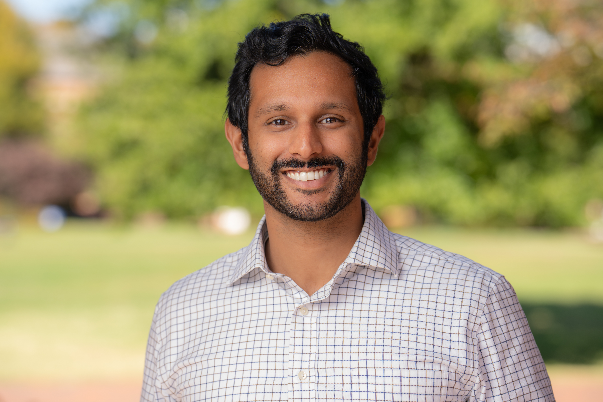
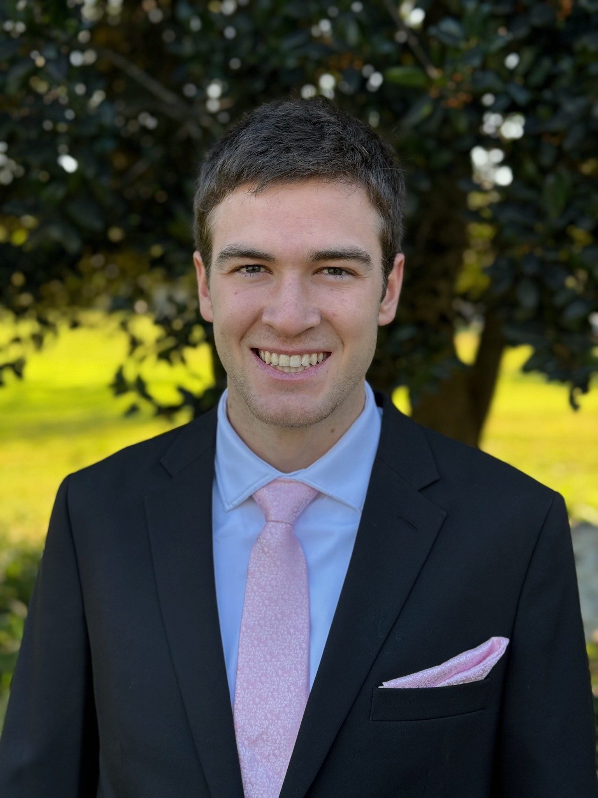
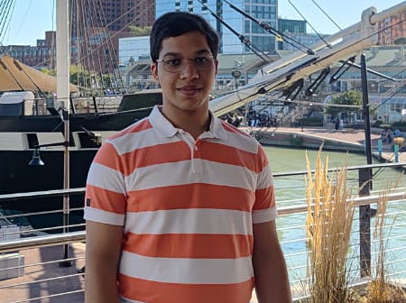

# Optimal Control for Space Systems (EN.530.626)

## Course Description
Trajectory design and control for aerospace systems encompasses a broad range of system dynamics, physical constraints, and other safety considerations.
Optimal control offers a powerful paradigm to solve such problems and this course introduces the theoretical and practical foundations of optimal control as applied to aerospace and robotic applications.
In particular, a strong emphasis is placed on real-time planning and control via the use of on-board numerical optimization and students will apply theoretical insights from trajectory optimization and model predictive control for developing real-time controllers.
Students will apply this theory to practice through coding implementations in Python and evaluation in simple simulation environments, with applications including planetary rover path planning, rocket powered descent guidance, and spacecraft controls.
Finally, a course project will be included to allow students to gain further experience on an algorithm or application of their choice.

## Instructors 
<!-- [Prof. Abhishek Cauligi](https://acauligi.github.io) -->

  
  
<a href="https://acauligi.github.io">Prof. Abhishek Cauligi</a>

## Course Assistants
<!-- Patrick Schwartz

Marvat Johri -->

  

    
    
Patrick Schwartz

  

  
  

    
    
Marvat Johri

  

## Meeting Times
Lectures will be held on Tuesdays and Thursdays from 1:30-2:45PM in Latrobe 107.

## Office Hours
Office hours will begin from the second week of the semester. Fall 2026 office hours will be announced at the start of the semester.

- **Prof. Abhishek Cauligi**: Thursday 3--4PM (Hackerman 117).
- **Patrick Schwartz**: Wednesday, 10---11AM (Hackerman 111).
- **Marvat Johri**: Monday, 3---4PM (Hackerman 111).

## Syllabus
The syllabus for the course can be found [here](./assets/pdf/syllabus.pdf).

## Final Project
This class will culminate with a final project that will allow students to explore topics of their interest and pursue potential research applications.
Details on the final project can be found [here](./assets/pdf/final_project.pdf). 

## Schedule

| Week | Date | Topics Covered | Notes | Suggested Readings |
|------|------|-----------------|--------------|---------------------|
| 1 | 09/01 | Course introduction | [L1 Notes](./assets/pdf/lecture_1.pdf) | [Learn git](https://learngitbranching.js.org/?locale=en_US), [Learn shell](https://www.learnshell.org/), [Docker tutorial](https://docker-curriculum.com/) |
|  | 09/03| Gradient descent and Newton method | [HW1 Out](./assets/pdf/homework_1.pdf), [L2 Notes](./assets/pdf/lecture_2.pdf) | [1](https://arxiv.org/abs/2510.15734) |
| 2 | 09/08 | Linear least squares | | [1](https://ee263.stanford.edu/lectures/25q3/original/10_ls.pdf)  |
|  | 09/10 | Linear least norm and equality-constrained Newton method | | [1](https://ee263.stanford.edu/lectures/25q3/original/13_min-norm.pdf), [2](https://www.stat.cmu.edu/~ryantibs/convexopt/lectures/newton.pdf) |
| 3  | 09/15 | Inequality constrained optimization |  | |
| | 09/17| Duality and KKT conditions | HW1 In, HW2 Out | [1](https://www.stat.cmu.edu/~ryantibs/convexopt/lectures/kkt.pdf) |
| 4 | 09/22 | Primal-dual interior point methods |  | [1](https://www.stat.cmu.edu/~ryantibs/convexopt/lectures/barr-method.pdf), [2](https://www.stat.cmu.edu/~ryantibs/convexopt/lectures/primal-dual.pdf) |
|  | 09/24| Linear systems theory | Quiz 1 | [1](https://ee263.stanford.edu/lectures/lds.pdf), [2](https://ee263.stanford.edu/lectures/expm.pdf) |
| 5 | 09/29 | From continuous to discrete optimal control | | |
|  | 10/01 | Off-the-shelf trajectory optimization | HW2 In, HW3 Out | [1](https://epubs.siam.org/doi/10.1137/16M1062569), [2](https://link.springer.com/article/10.1023/A:1021711402723) |
| 6 | 10/06 | Powered descent guidance |  | [1](https://arc.aiaa.org/doi/10.2514/1.27553), [2](https://arc.aiaa.org/doi/10.2514/1.47202) |
|   | 10/08 | Linear quadratic regulator | Quiz 2  | |
| 7  | 10/13 | Differentiable optimization | Final project proposals in | [1](https://arxiv.org/pdf/2504.15851v1), [2](https://link.springer.com/article/10.1007/BF01580677) |
|   | 10/15 | Combinatorial planning with integer programs | HW3 In, HW4 Out  | [1](https://arxiv.org/abs/2107.08143), [2](https://arc.aiaa.org/doi/10.2514/2.4943) |
| 8 | 10/20 | Sampling-based motion planning | | |
|   | 10/22 | **No Lecture (Fall Break)** | | |
| 9 | 10/27 | Inverse classroom (mid-semester checkpoint) | Quiz 3 | |
|   | 10/29 | Guest lecture by Parth Nobel | HW4 In | [1](https://arxiv.org/pdf/2606.14891) |
| 10 | 11/03 | Surface rover path planning |  | |
|   | 11/05 | Long and short range planner hierarchies | Quiz 4 |  |
| 11 | 11/10 | Guest lecture by Dr. Justin Atchison | | |
|    | 11/12 | Derivative-free methods for trajectory optimization | | [1](https://arxiv.org/pdf/2506.22087v1), [2](https://www.roboticsproceedings.org/rss07/p22.pdf), [3](https://arc.aiaa.org/doi/pdf/10.2514/1.G001921) |
| 12 | 11/17 | Stochastic optimal control (Pt. 1)  | | |
|    | 11/19| Stochastic optimal control (Pt. 2) | Quiz 5  | |
| 13 | 11/24 | **No Lecture (Thanksgiving Break)** | | |
|    | 11/26 | **No Lecture (Thanksgiving Break)** | | |
| 14 | 12/01 | Special topics (TBD) | | |
|    | 12/03 | Special topics (TDB) | | |
| 15 | 12/08 | Teaching team evaluations | Final project report in | |
|    | 12/10 | Teaching team evaluations | | |
| 16 | 12/15 | Final project presentations (6 - 9PM) | | |
|    | 12/17 | **No Lecture (Exam Week)** | | |
